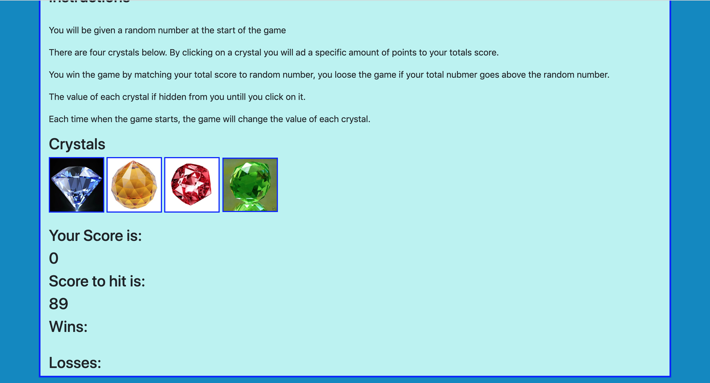

# Overview

Crystall Collector is a simple front-end app/ game that gives player four crystals with hidden number values. The goal is to click the crystals and combine their values. If user's score matches target score user wins.

## Landing Page

This is the view of the page. When you open the app you'll see four crystals and target score. Each crystal has its own value.  

## Rules and Instructions
* Click on any crystal
* Your goal is to match the target score
* If your score matches the target score you win 
* if your score is more than target score you loose

## Technologies
* HTML5
* CSS3
* Javascript
* jQuery

Feel free to clone this repo and create your own crystal collector app.